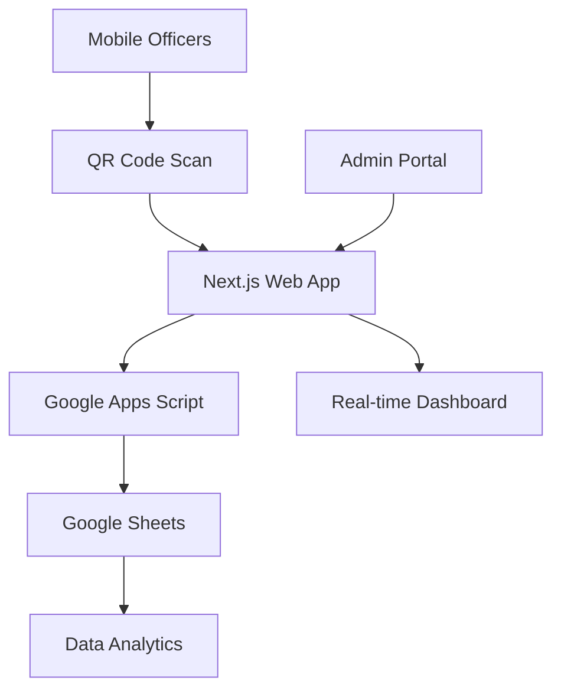

What is SecureVision?
SecureVision is a comprehensive security incident management system designed for modern security operations. Built with Next.js and integrated with Google Sheets, it provides a professional, mobile-first solution for tracking, analyzing, and reporting security incidents.
Key Features

Mobile-First Incident Reporting - QR code based reporting system for field officers
Real-Time Dashboard - Live analytics with charts and trend analysis
Google Sheets Integration - No database required, uses Google Sheets as backend
Custom Branding - Complete white-label customization
Multi-Step Setup Wizard - Deploy in minutes with guided configuration
Admin Management - Add sites, officers, categories through web interface
Professional Reporting - Automated analytics and executive summaries
License Protection - Built-in anti-piracy system
# 🛡️ SecureVision - Professional Security Incident Management System

> **Enterprise-Grade Security Incident Tracking with Real-Time Google Sheets Integration**

[](LICENSE.md)
[](https://nextjs.org/)
[](https://typescriptlang.org/)
[](https://sheets.google.com/)

---

## 🎯 What is SecureVision?

SecureVision is a comprehensive security incident management system designed for modern security operations. Built with Next.js and integrated with Google Sheets, it provides a professional, mobile-first solution for tracking, analyzing, and reporting security incidents.

### ⭐ Key Features

- **📱 Mobile-First Incident Reporting** - QR code based reporting system for field officers
- **📊 Real-Time Dashboard** - Live analytics with charts and trend analysis  
- **🔗 Google Sheets Integration** - No database required, uses Google Sheets as backend
- **🎨 Custom Branding** - Complete white-label customization
- **📋 Multi-Step Setup Wizard** - Deploy in minutes with guided configuration
- **👥 Admin Management** - Add sites, officers, categories through web interface
- **📈 Professional Reporting** - Automated analytics and executive summaries
- **🔒 License Protection** - Built-in anti-piracy system

---

## 🚀 Quick Demo

**[View Live Demo →](https://securevision-demo.vercel.app)**

*Experience SecureVision with sample data*

---

## 📸 Screenshots

<div align="center">

### Setup Wizard


### Mobile Incident Reporting  


### Admin Dashboard


### QR Code Generation


</div>

---

## 🏗️ Architecture



### Technology Stack
- **Frontend**: Next.js 15, React 18, TypeScript
- **UI Components**: Radix UI, Tailwind CSS
- **Backend**: Google Apps Script + Google Sheets
- **Charts**: Recharts
- **Forms**: React Hook Form + Zod validation
- **Mobile**: Progressive Web App (PWA) ready

---

## ⚡ Quick Start

### Prerequisites
- Node.js 18+
- Google account
- 15 minutes

### Installation

```bash
# Clone the repository
git clone https://github.com/xtenalyze/securesheet-vision-complete.git
cd securesheet-vision-complete

# Install dependencies
npm install

# Start development server
npm run dev
```

### Setup
1. Open `http://localhost:3000`
2. Complete the 5-step setup wizard
3. Deploy to Vercel/Netlify
4. Generate QR codes for mobile reporting

📚 **[Full Setup Guide →](docs/QUICK-START.md)**

---

## 🔧 Configuration

### Google Sheets Setup
1. Create Google Spreadsheet with required sheets
2. Set up Google Apps Script for data processing
3. Configure in SecureVision setup wizard

### Environment Variables
```bash
# Copy example environment file
cp .env.example .env.local

# Configure your settings
NEXT_PUBLIC_GOOGLE_SCRIPT_URL=your_apps_script_url
NEXT_PUBLIC_GOOGLE_SHEETS_ID=your_sheet_id
```

---

## 🚀 Deployment Options

### Vercel (Recommended)
```bash
npm install -g vercel
vercel
```

### Netlify
```bash
npm run build
npm run export
# Upload 'out' folder to Netlify
```

### GitHub Pages
```bash
# Enable Pages in repository settings
# Deploy from 'docs' folder
```

---

## 📋 Features

### ✅ **Admin Portal**
- Site management
- Officer registration  
- Incident categorization
- Shift scheduling
- Real-time data sync

### ✅ **Mobile Reporting**
- QR code instant access
- Multi-step incident forms
- GPS coordinate capture
- Photo attachments
- Offline capability

### ✅ **Dashboard & Analytics**
- Real-time incident metrics
- Trend analysis charts
- Severity distribution
- Site performance tracking
- Executive summaries

### ✅ **Integration & Security**
- Google Sheets backend
- No database required
- Built-in license protection
- Custom domain support
- Professional branding

---

## 🏢 Perfect For

- **🏬 Retail Security** - Loss prevention and incident tracking
- **🏢 Corporate Security** - Employee and visitor management
- **🏠 Property Management** - Tenant incident logging
- **🏭 Industrial Security** - Safety incident reporting
- **🚔 Security Companies** - Multi-client management
- **🏥 Healthcare** - Patient and staff incidents

---

## 📊 Sample Data Flow

### Admin Workflow
1. **Setup** → Configure company branding and Google integration
2. **Manage** → Add sites, officers, incident categories
3. **Monitor** → View real-time dashboard and analytics

### Field Officer Workflow  
1. **Scan** → QR code with phone camera
2. **Report** → Fill mobile-optimized incident form
3. **Submit** → Data goes directly to Google Sheets

### Management Workflow
1. **Review** → Real-time dashboard with key metrics
2. **Analyze** → Trend reports and severity analysis
3. **Export** → Professional reports for clients

---

## 🛡️ License & Security

### License Protection
- Each deployment includes unique license validation
- Domain-locked for security
- Anti-piracy protection built-in
- Commercial use requires valid license

### Data Security
- Data stored in customer's Google Sheets
- No data transmitted to third parties
- HTTPS encryption for all communication
- Access controlled by Google account permissions

---

## 📚 Documentation

### Getting Started
- [🚀 Quick Start Guide](docs/QUICK-START.md) - 5-minute setup
- [📖 Installation Guide](docs/INSTALLATION.md) - Detailed setup
- [⚙️ Configuration Guide](docs/CONFIGURATION.md) - Customization options

### Advanced Topics
- [🔧 Google Sheets Setup](docs/GOOGLE-SHEETS.md) - Backend configuration
- [🎨 Branding Guide](docs/BRANDING.md) - Custom styling
- [🚀 Deployment Guide](docs/DEPLOYMENT.md) - Production deployment

### Support
- [❓ FAQ](docs/FAQ.md) - Common questions
- [🔧 Troubleshooting](docs/TROUBLESHOOTING.md) - Problem solving
- [📞 Support](docs/SUPPORT.md) - Getting help

---

## 🤝 Support & Community

### Professional Support
- **Email**: support@securevision-system.com
- **Response Time**: 24 hours (business days)
- **Video Consultations**: Available for licensed customers

### Self-Service Resources
- **Documentation**: Comprehensive guides in `/docs`
- **GitHub Issues**: Bug reports and feature requests
- **Community Forum**: User discussions and tips

---

## 🏆 Success Stories

> *"SecureVision transformed our incident management. We went from manual logbooks to a professional digital system in one afternoon."*  
> **— Sarah Johnson, Security Manager**

> *"The QR code system is brilliant. Our officers can report incidents in under 2 minutes."*  
> **— Mike Rodriguez, Field Supervisor**

> *"Client reporting used to take hours. Now it's automated and looks incredibly professional."*  
> **— Lisa Chen, Operations Director**

---

## 📈 Roadmap

### Current Version (1.0)
- ✅ Core incident management
- ✅ Google Sheets integration
- ✅ Mobile QR reporting
- ✅ Admin portal
- ✅ Real-time dashboard

### Upcoming Features (1.1)
- 🔄 Automated email notifications
- 📊 Advanced analytics
- 🔗 Third-party integrations
- 📱 Progressive Web App improvements
- 🌐 Multi-language support

---

## 💰 Licensing

This is a **commercial product**. The code in this repository is for:
- **Demonstration purposes** 
- **Licensed customers** with valid purchase
- **Evaluation** by prospective buyers

### Purchase Options
- **Standard**: $297 - Single organization
- **Professional**: $497 - Multi-client support  
- **Enterprise**: $997 - White-label rights

**[🛒 Purchase License →](https://gumroad.com/l/securevision-pro)**

---

## 🔒 License Validation

This software includes built-in license validation:
- Validates license on startup
- Domain-locked deployment
- Feature restrictions based on license tier
- Anti-piracy protection

Unauthorized use is prohibited and will result in application restrictions.

---

## 🛠️ Development

### Local Development
```bash
npm run dev          # Start development server
npm run build        # Build production version
npm run lint         # Run ESLint
npm run type-check   # TypeScript validation
```

### Testing
```bash
npm run setup        # Validate setup requirements
npm run test         # Run test suite (if available)
```

---

## 📄 Legal

### Copyright
© 2024 SecureVision Systems. All rights reserved.

### License
This software is licensed under a commercial license. See [LICENSE.md](LICENSE.md) for details.

### Trademarks
SecureVision is a trademark of SecureVision Systems.

---

<div align="center">

**Ready to transform your security operations?**

[](https://gumroad.com/l/securevision-pro)

**Questions?** Email us at sales@securevision-system.com

---

*Built with ❤️ for security professionals worldwide*

</div>
